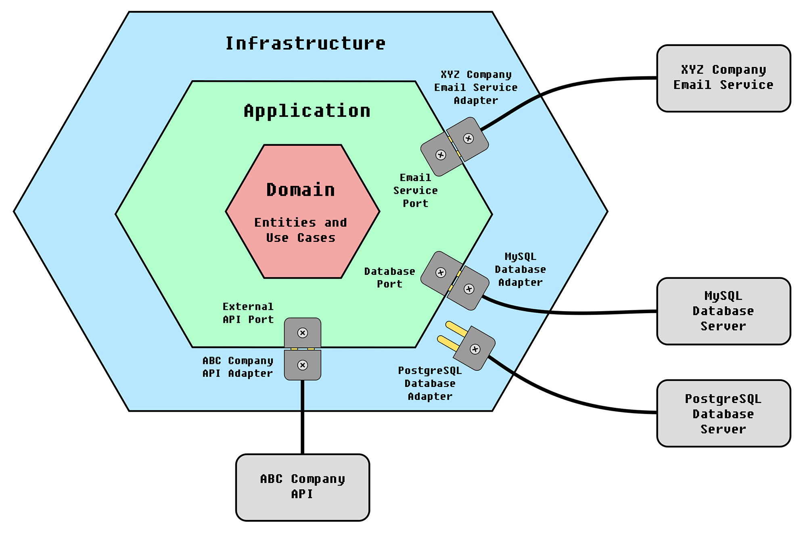
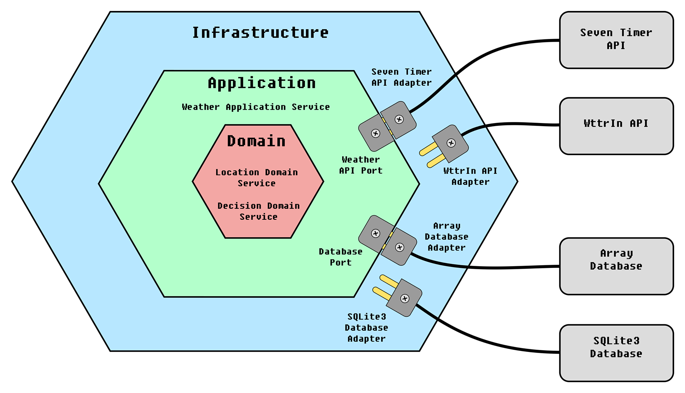

# Arquitetura Hexagonal com exemplo implementado em Python

---

[ [English](README.md) | Português do Brasil ]

## Visão Geral

Arquitetura Hexagonal, ou Arquitetura de Portas e Adaptadores, é um padrão arquitetural de design de software. Seu objetivo é prover um fraco acoplamento entre componentes da aplicação e o ambiente de infraestrutura, através de porta e adaptadores.

Esse padrão foi inventado por [Alistair Cockburn](https://en.wikipedia.org/wiki/Alistair_Cockburn), na tentativa de evitar certas armadilhas estruturais conhecidas no design de software orientado a objeto, como dependências indesejadas entre camadas e contaminação de código de interface do usuário com lógicas de negócio.

Nesse padrão, toda a lógica de negócio fica em uma camada de Domínio e não depende absolutamente em nada de outros elementos da aplicação, como APIs e bancos de dados. A camada de aplicação, por sua vez, se conecta ao mundo externo (infraestrutura) através de portas. A infraestrutura se conecta à aplicação através de adaptadores, desenhados especificamente para as portas em questão.
Entre essas camadas, é feita uma inversão de controle, onde a camada de Domínio não depende da camada de aplicação, e sim o contrário. Da mesma forma, a camada de aplicação não depende da Infraestrutura, e sim o contrário.

Referência: [Wikipedia](https://en.wikipedia.org/wiki/Hexagonal_architecture_(software)).

Exemplo de Arquitetura Hexagornal:

## Exemplo

Neste exemplo implementado em Python, temos as seguintes características:

- A aplicação deve consultar uma API externa para obter a temperatura de um local e armazenar em um banco de dados. Depois disso, deve ler o último registro do banco de dados e tomar uma decisão: Se a temperatura for negativa, aconselhar o usuário a não sair de casa. Se a temperatura for positiva, mas abaixo de 20 graus celsius, aconselhar o usuário a levar uma blusa se sair, em outra caso, informar o usuário que ele pode sair livremente.

- A camada de Domínio possui duas entidades: LocationDomainService, que é responsável por determinar o local geográfico de onde se deseja obter informações climáticas e DecisionDomainService, que é responsável por tomar uma decisão com base na temperatura do local. Essa decisão é qual desses conselhos dar ao usuário. De acordo com esse padrão arquitetural, essa é uma camada puramente destinada à logica de negócio e em nenhum momento consulta dados de fora dela.

- A camada Aplicação é responsável por orquestrar o funcionamento da aplicação. Ela consulta a camada de domínio para obter dados do local e também para obter uma decisão com base na temperatura coletada. Ela se comunica com o mundo externo (Infraestrutura) a partir de portas.

- Na camada Infraestrutura é onde estão os adaptadores (possivelmente bibliotecas, etc) usados para conectar a Aplicação ao mundo exterior, como banco de dados e APIs. Neste exemplo, existem dois adaptadores disponíveis para que a Aplicação possa consultar dados climáticos: Um adaptador para conexão com o serviço Seven Timer e outro para conexão com o serviço Wttr In. Também existem dois adaptadores para conexão com banco de dados: Um deles implementa o banco de dados SQLite3 e outro implementa um array em memória, aqui usado como se fosse um banco de dados.

Observe que no arquivo main.py as linhas 9 a 12 determinam se o banco de dados será o Array ou SQLite3, bem como se a API climática será a Seven Timer ou a Wttr In. Esse é um dos objetivos desse padrão: A simples troca de recursos de infraestrutura através da troca de adaptadores. 