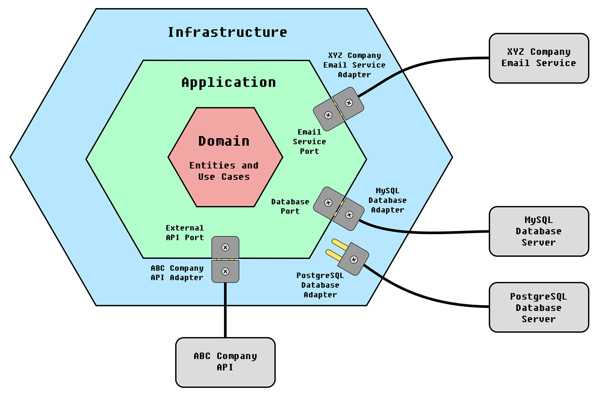
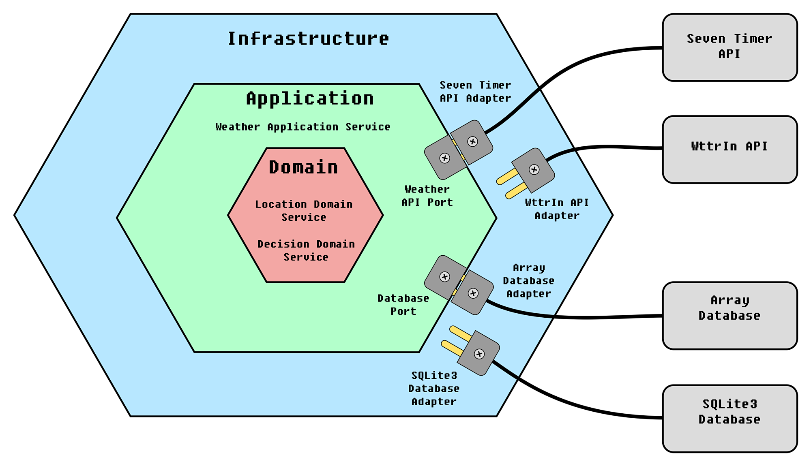

# Python example for hexagonal architecture implementation

---

[ English | [Português do Brasil](README-PT.md) ]

## Overview

Hexagonal Architecture, or Ports and Adapters Architecture, is a software design architectural pattern. It aims at creating a loseless coupling between application components and the infrastructure environment, through ports and adapters.

This pattern was invented by [Alistair Cockburn](https://en.wikipedia.org/wiki/Alistair_Cockburn), in an attempt to avoid certain structural pitfalls known in object-oriented software design, such as unwanted dependencies between layers and contamination of user interface code with business logic.

In this pattern, all business logic is located in a Domain layer and does not depend at all on other application elements, such as APIs and databases. The Application layer connects to the external world (infrastructure) through ports. The infrastructure is connected to the application through adapters, specifically designed for the ports in question.
Between these layers, an inversion of control is made, 
in which the Domain layer does not depend on the application layer, but the opposite. Likewise, the application layer does not depend on the Infrastructure, but rather the opposite.

Reference: [Wikipedia](https://en.wikipedia.org/wiki/Hexagonal_architecture_(software)).

Example of Hexagonal Architecture:

## Example

This example implemented in Python has the following characteristics:

- The application must request an external API to obtain the temperature of a location and store it in a database. After that, it must read the last record in the database and make a decision: If the temperature is negative, advise the user not to go out. If the temperature is positive but below 20 degrees Celsius, advise the user to take a sweater, otherwise inform the user that they can go out freely.

- The Domain layer has two entities: LocationDomainService, responsible for determining the geographic location from which you want to obtain climate information, and DecisionDomainService, which is responsible for making a decision based on the temperature. The decision is what advice to give the user. According to this architectural pattern, this is a layer purely intended for business logic and never consults data from outside it.

- The Application layer is responsible for orchestrating all the operation. It queries the domain layer to obtain location data and also to obtain a decision based on the collected temperature. It communicates with the external world (Infrastructure) through ports.

- The Infrastructure layer is where are the adapters (possibly libraries, etc.) used to connect the Application to the outside world, such as databases and APIs. In this example, there are two weather API adapters available: One adapter for connection to the Seven Timer service and another to connect to the Wttr In service. There are also two adapters for connecting to the database: One of them implements the SQLite3 database and the other implements an in-memory array, used here as a database.

Note that in the main.py file, lines 9 to 12 determine the database used: Array or SQLite3, as well as whether the climate API: Seven Timer or Wttr In. This is one of the goals in this pattern: The simple exchange of infrastructure resources by choosing between adapters.
